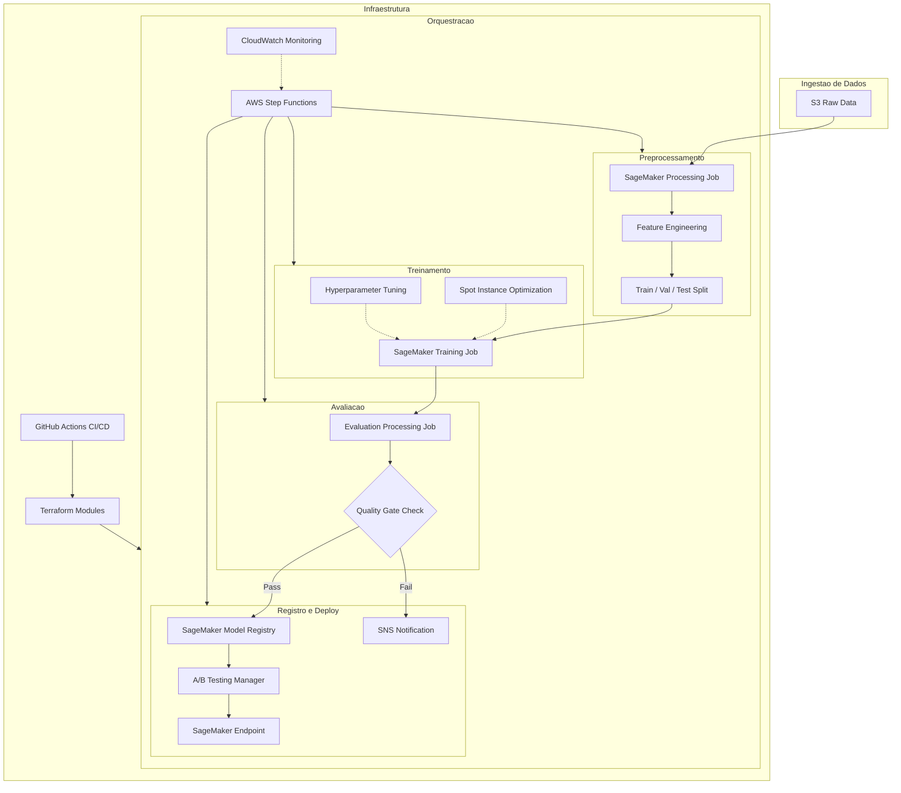
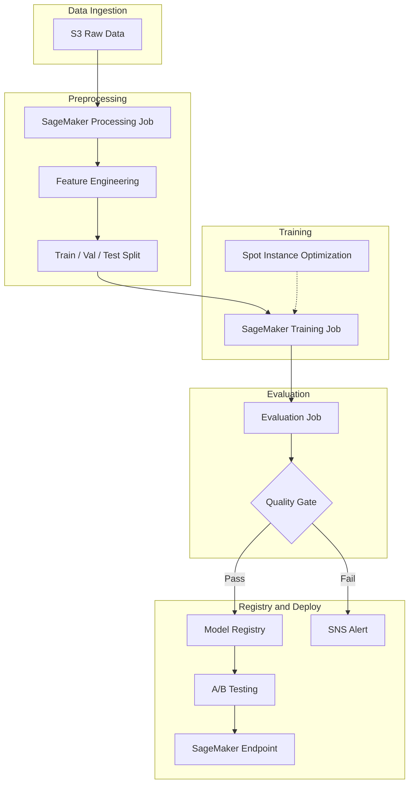

<div align="center">

# SageMaker MLOps Pipeline AWS


Pipeline MLOps end-to-end com AWS SageMaker, Step Functions e infraestrutura como codigo com Terraform

[Portugues](#portugues) | [English](#english)

</div>

---

<a name="portugues"></a>

## Sobre

Pipeline MLOps completo construido sobre AWS SageMaker, orquestrado via Step Functions e provisionado com Terraform. O projeto implementa o ciclo de vida completo de modelos de machine learning em producao: preprocessamento de dados, treinamento com spot instances para otimizacao de custos, avaliacao automatizada com quality gates, registro no Model Registry e deploy com suporte a A/B testing entre variantes de endpoint. O pipeline utiliza quality gates configuraveis que bloqueiam automaticamente a promocao de modelos que nao atingem limiares minimos de performance, garantindo que apenas modelos validados cheguem a producao.

## Tecnologias

| Categoria | Tecnologia |
|-----------|-----------|
| **Cloud** | AWS SageMaker, S3, ECR, Step Functions, CloudWatch, SNS |
| **ML** | scikit-learn, XGBoost, LightGBM, NumPy, Pandas |
| **IaC** | Terraform (modulos S3, SageMaker, Step Functions) |
| **CI/CD** | GitHub Actions (lint, test, build, terraform validate) |
| **Containers** | Docker, LocalStack (dev) |
| **Linguagem** | Python 3.11+ |

## Arquitetura



## Estrutura do Projeto

```
sagemaker-mlops-pipeline-aws/
├── .github/workflows/ci.yml         # Pipeline CI/CD
├── config/pipeline_config.yaml       # Configuracao do pipeline
├── docker/
│   ├── Dockerfile                    # Container de ML
│   └── docker-compose.yml            # LocalStack para dev
├── step_functions/
│   └── ml_pipeline_definition.json   # Definicao do state machine
├── terraform/
│   ├── main.tf                       # Infraestrutura principal
│   ├── variables.tf
│   ├── outputs.tf
│   └── modules/
│       ├── s3/main.tf                # Buckets com encryption
│       ├── sagemaker/main.tf         # IAM roles e policies
│       └── step_functions/           # State machine
├── src/
│   ├── config/settings.py            # Configuracao centralizada
│   ├── processing/preprocessing.py   # Feature engineering e splits
│   ├── training/
│   │   ├── train.py                  # Treinamento SageMaker
│   │   └── hyperparameters.py        # Tuning de hiperparametros
│   ├── evaluation/model_evaluator.py # Avaliacao com quality gates
│   ├── inference/
│   │   ├── inference_handler.py      # Handler do endpoint
│   │   └── serializer.py            # Serializacao request/response
│   ├── pipelines/
│   │   ├── sagemaker_pipeline.py     # Builder do pipeline
│   │   └── step_functions_orchestrator.py
│   ├── ab_testing/traffic_manager.py # Gerenciamento de trafego A/B
│   └── utils/
│       ├── logger.py                 # Logging estruturado
│       └── aws_helpers.py            # Helpers AWS
├── tests/
│   ├── conftest.py
│   ├── unit/                         # Testes unitarios
│   └── integration/                  # Testes end-to-end
├── Dockerfile
├── Makefile
├── requirements.txt
├── CONTRIBUTING.md
├── LICENSE
└── README.md
```

## Inicio Rapido

### Pre-requisitos

- Python 3.11+
- AWS CLI configurado
- Terraform >= 1.5
- Docker (opcional, para desenvolvimento local)

### Instalacao

```bash
git clone https://github.com/galafis/sagemaker-mlops-pipeline-aws.git
cd sagemaker-mlops-pipeline-aws
make install
```

### Infraestrutura (Terraform)

```bash
make terraform-init
ENV=dev make terraform-plan
ENV=dev make terraform-apply
```

### Docker (Desenvolvimento Local)

```bash
make docker-build
make docker-run    # Inicia LocalStack + container ML
make docker-stop
```

### Exemplo de Uso

```python
from src.pipelines.sagemaker_pipeline import create_default_pipeline
from src.ab_testing.traffic_manager import TrafficManager, VariantConfig

# Criar pipeline padrao
pipeline = create_default_pipeline()

# Configurar A/B testing
manager = TrafficManager()
champion = VariantConfig(variant_name="v1", model_name="model-v1")
challenger = VariantConfig(variant_name="v2", model_name="model-v2")
split = manager.setup_ab_test(champion, challenger, challenger_traffic=0.10)
```

## Testes

```bash
make test       # Testes unitarios
make test-cov   # Com cobertura
make lint       # Qualidade de codigo
```

## Aprendizados

- Implementacao de pipelines MLOps completos com SageMaker Processing, Training e Endpoints
- Orquestracao de workflows ML com AWS Step Functions e state machines
- Infraestrutura como codigo com Terraform modularizado para recursos AWS
- Quality gates automatizados para bloquear promocao de modelos abaixo dos limiares
- A/B testing entre variantes de modelo com controle de trafego progressivo
- Otimizacao de custos com spot instances e gerenciamento de ciclo de vida

## Autor

**Gabriel Demetrios Lafis**

- GitHub: [@galafis](https://github.com/galafis)
- LinkedIn: [Gabriel Demetrios Lafis](https://www.linkedin.com/in/gabriel-demetrios-lafis/)

## Licenca

Este projeto esta licenciado sob a MIT License - veja o arquivo [LICENSE](LICENSE) para detalhes.

---

<a name="english"></a>

## About

End-to-end MLOps pipeline built on AWS SageMaker, orchestrated via Step Functions, and provisioned with Terraform. The project implements the complete machine learning model lifecycle in production: data preprocessing, training with spot instances for cost optimization, automated evaluation with quality gates, Model Registry registration, and deployment with A/B testing support across endpoint variants. The pipeline uses configurable quality gates that automatically block promotion of models that do not meet minimum performance thresholds, ensuring only validated models reach production.

## Technologies

| Category | Technology |
|----------|-----------|
| **Cloud** | AWS SageMaker, S3, ECR, Step Functions, CloudWatch, SNS |
| **ML** | scikit-learn, XGBoost, LightGBM, NumPy, Pandas |
| **IaC** | Terraform (S3, SageMaker, Step Functions modules) |
| **CI/CD** | GitHub Actions (lint, test, build, terraform validate) |
| **Containers** | Docker, LocalStack (dev) |
| **Language** | Python 3.11+ |

## Architecture



## Quick Start

### Prerequisites

- Python 3.11+
- AWS CLI configured
- Terraform >= 1.5
- Docker (optional)

### Installation

```bash
git clone https://github.com/galafis/sagemaker-mlops-pipeline-aws.git
cd sagemaker-mlops-pipeline-aws
make install
make test
```

## Docker

```bash
make docker-build
make docker-run
make docker-stop
```

## Tests

```bash
make test       # Unit tests
make test-cov   # With coverage
make lint       # Code quality
```

## Learnings

- Implementing complete MLOps pipelines with SageMaker Processing, Training, and Endpoints
- Orchestrating ML workflows with AWS Step Functions and state machines
- Infrastructure as Code with modular Terraform for AWS resources
- Automated quality gates to block promotion of underperforming models
- A/B testing between model variants with progressive traffic control
- Cost optimization with spot instances and lifecycle management

## Author

**Gabriel Demetrios Lafis**

- GitHub: [@galafis](https://github.com/galafis)
- LinkedIn: [Gabriel Demetrios Lafis](https://www.linkedin.com/in/gabriel-demetrios-lafis/)

## License

This project is licensed under the MIT License - see the [LICENSE](LICENSE) file for details.
