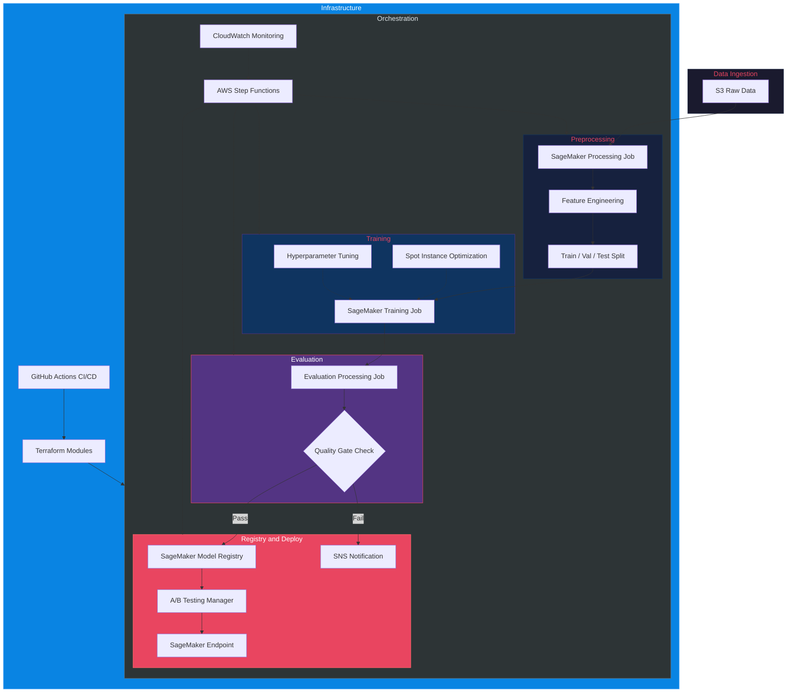

<div align="center">


# sagemaker-mlops-pipeline-aws

Pipeline MLOps end-to-end com AWS SageMaker, Step Functions e infraestrutura como codigo com Terraform

[Portugues](#portugues) | [English](#english)

</div>

---

## Portugues

### Sobre

Pipeline MLOps completo construido sobre AWS SageMaker, orquestrado via Step Functions e provisionado com Terraform. O projeto implementa o ciclo de vida completo de modelos de machine learning em producao: preprocessamento de dados, treinamento com spot instances para otimizacao de custos, avaliacao automatizada com quality gates, registro no Model Registry, e deploy com suporte a A/B testing entre variantes de endpoint.

O pipeline utiliza quality gates configuráveis que bloqueiam automaticamente a promoção de modelos que não atingem limiares mínimos de performance, garantindo que apenas modelos validados cheguem a produção.

### Tecnologias

| Categoria | Tecnologias |
|-----------|------------|
| **Cloud** | AWS SageMaker, S3, ECR, Step Functions, CloudWatch, SNS |
| **ML** | scikit-learn, XGBoost, LightGBM, NumPy, Pandas |
| **IaC** | Terraform (módulos S3, SageMaker, Step Functions) |
| **CI/CD** | GitHub Actions (lint, test, build, terraform validate) |
| **Containers** | Docker, LocalStack (dev) |
| **Linguagem** | Python 3.11+ |

### Arquitetura


### Estrutura do Projeto

```
sagemaker-mlops-pipeline-aws/
├── .github/
│   └── workflows/
│       └── ci.yml                    # CI/CD pipeline
├── config/
│   └── pipeline_config.yaml          # Configuracao do pipeline
├── docker/
│   ├── Dockerfile                    # Container de ML
│   └── docker-compose.yml            # LocalStack para dev
├── step_functions/
│   └── ml_pipeline_definition.json   # Definicao do state machine
├── terraform/
│   ├── main.tf                       # Infraestrutura principal
│   ├── variables.tf                  # Variaveis de entrada
│   ├── outputs.tf                    # Saidas do Terraform
│   └── modules/
│       ├── s3/main.tf                # Buckets S3 com encryption
│       ├── sagemaker/main.tf         # IAM roles e policies
│       └── step_functions/
│           ├── main.tf               # State machine
│           └── definition.json.tpl   # Template do workflow
├── src/
│   ├── config/
│   │   └── settings.py               # Configuracao centralizada
│   ├── processing/
│   │   └── preprocessing.py          # Feature engineering e splits
│   ├── training/
│   │   ├── train.py                  # Treinamento SageMaker
│   │   └── hyperparameters.py        # Tuning de hiperparametros
│   ├── evaluation/
│   │   └── model_evaluator.py        # Avaliacao com quality gates
│   ├── inference/
│   │   ├── inference_handler.py      # Handler SageMaker endpoint
│   │   └── serializer.py             # Serializacao request/response
│   ├── pipelines/
│   │   ├── sagemaker_pipeline.py     # Builder do pipeline SM
│   │   └── step_functions_orchestrator.py  # Orquestrador SF
│   ├── ab_testing/
│   │   └── traffic_manager.py        # Gerenciamento de trafego A/B
│   └── utils/
│       ├── logger.py                 # Logging estruturado
│       └── aws_helpers.py            # Helpers AWS (S3, sessions)
├── tests/
│   ├── conftest.py                   # Fixtures compartilhadas
│   ├── unit/
│   │   ├── test_preprocessing.py
│   │   ├── test_training.py
│   │   ├── test_inference.py
│   │   ├── test_evaluation.py
│   │   ├── test_pipeline.py
│   │   └── test_ab_testing.py
│   └── integration/
│       └── test_end_to_end.py        # Pipeline completo local
├── .gitignore
├── CONTRIBUTING.md
├── LICENSE
├── Makefile
├── README.md
└── requirements.txt
```

### Inicio Rapido

#### Pre-requisitos

- Python 3.11+
- AWS CLI configurado
- Terraform >= 1.5
- Docker (opcional, para desenvolvimento local)

#### Instalacao

```bash
# Clonar repositorio
git clone https://github.com/galafis/sagemaker-mlops-pipeline-aws.git
cd sagemaker-mlops-pipeline-aws

# Instalar dependencias
make install

# Executar testes
make test
```

#### Infraestrutura (Terraform)

```bash
# Inicializar Terraform
make terraform-init

# Planejar infraestrutura
ENV=dev make terraform-plan

# Aplicar infraestrutura
ENV=dev make terraform-apply
```

#### Docker (Desenvolvimento Local)

```bash
# Build da imagem
make docker-build

# Subir ambiente com LocalStack
make docker-run

# Parar ambiente
make docker-stop
```

#### Exemplo de Uso

```python
from src.pipelines.sagemaker_pipeline import create_default_pipeline
from src.ab_testing.traffic_manager import TrafficManager, VariantConfig

# Criar pipeline padrao
pipeline = create_default_pipeline()

# Configurar A/B testing
manager = TrafficManager()
champion = VariantConfig(variant_name="v1", model_name="model-v1")
challenger = VariantConfig(variant_name="v2", model_name="model-v2")
split = manager.setup_ab_test(champion, challenger, challenger_traffic=0.10)

# Avaliar resultados
result = manager.evaluate_ab_test(
    champion_metrics={"f1": 0.82, "accuracy": 0.85},
    challenger_metrics={"f1": 0.86, "accuracy": 0.88},
)
print(result.recommendation)
```

### Testes

```bash
# Testes unitarios
make test

# Com cobertura
make test-cov

# Lint
make lint
```

### Autor

**Gabriel Demetrios Lafis**

- GitHub: [@galafis](https://github.com/galafis)
- LinkedIn: [Gabriel Demetrios Lafis](https://www.linkedin.com/in/gabriel-demetrios-lafis/)

### Licenca

Este projeto esta licenciado sob a licenca MIT - veja o arquivo [LICENSE](LICENSE) para detalhes.

---

## English

### About

End-to-end MLOps pipeline built on AWS SageMaker, orchestrated via Step Functions, and provisioned with Terraform. The project implements the complete machine learning model lifecycle in production: data preprocessing, training with spot instances for cost optimization, automated evaluation with quality gates, Model Registry registration, and deployment with A/B testing support across endpoint variants.

The pipeline uses configurable quality gates that automatically block promotion of models that do not meet minimum performance thresholds, ensuring only validated models reach production.

### Technologies

| Category | Technologies |
|----------|-------------|
| **Cloud** | AWS SageMaker, S3, ECR, Step Functions, CloudWatch, SNS |
| **ML** | scikit-learn, XGBoost, LightGBM, NumPy, Pandas |
| **IaC** | Terraform (S3, SageMaker, Step Functions modules) |
| **CI/CD** | GitHub Actions (lint, test, build, terraform validate) |
| **Containers** | Docker, LocalStack (dev) |
| **Language** | Python 3.11+ |

### Architecture



### Project Structure

```
sagemaker-mlops-pipeline-aws/
├── .github/workflows/ci.yml         # CI/CD pipeline
├── config/pipeline_config.yaml       # Pipeline configuration
├── docker/                           # Docker and LocalStack
├── step_functions/                   # State machine definition
├── terraform/                        # IaC modules (S3, IAM, SFN)
├── src/
│   ├── config/settings.py            # Centralized configuration
│   ├── processing/preprocessing.py   # Feature engineering and splits
│   ├── training/                     # SageMaker training + tuning
│   ├── evaluation/model_evaluator.py # Evaluation with quality gates
│   ├── inference/                    # Endpoint handler + serializers
│   ├── pipelines/                    # SM Pipeline + Step Functions
│   ├── ab_testing/traffic_manager.py # A/B traffic management
│   └── utils/                        # Logging and AWS helpers
├── tests/                            # Unit and integration tests
├── Makefile                          # Dev commands
└── requirements.txt                  # Pinned dependencies
```

### Quick Start

#### Prerequisites

- Python 3.11+
- AWS CLI configured
- Terraform >= 1.5
- Docker (optional, for local development)

#### Installation

```bash
git clone https://github.com/galafis/sagemaker-mlops-pipeline-aws.git
cd sagemaker-mlops-pipeline-aws
make install
make test
```

#### Infrastructure (Terraform)

```bash
make terraform-init
ENV=dev make terraform-plan
ENV=dev make terraform-apply
```

#### Docker (Local Development)

```bash
make docker-build
make docker-run    # Starts LocalStack + ML container
make docker-stop
```

#### Usage Example

```python
from src.pipelines.sagemaker_pipeline import create_default_pipeline
from src.ab_testing.traffic_manager import TrafficManager, VariantConfig

# Create standard pipeline
pipeline = create_default_pipeline()

# Configure A/B testing
manager = TrafficManager()
champion = VariantConfig(variant_name="v1", model_name="model-v1")
challenger = VariantConfig(variant_name="v2", model_name="model-v2")
split = manager.setup_ab_test(champion, challenger, challenger_traffic=0.10)

# Evaluate results
result = manager.evaluate_ab_test(
    champion_metrics={"f1": 0.82, "accuracy": 0.85},
    challenger_metrics={"f1": 0.86, "accuracy": 0.88},
)
print(result.recommendation)
```

### Tests

```bash
make test       # Unit tests
make test-cov   # With coverage report
make lint       # Code quality checks
```

### Author

**Gabriel Demetrios Lafis**

- GitHub: [@galafis](https://github.com/galafis)
- LinkedIn: [Gabriel Demetrios Lafis](https://www.linkedin.com/in/gabriel-demetrios-lafis/)

### License

This project is licensed under the MIT License - see the [LICENSE](LICENSE) file for details.
